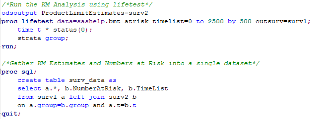

    
  
  ```{r setup, include = FALSE}
knitr::opts_chunk$set(
  collapse = TRUE,
  comment = "#>"
)
```

This guide will demonstrate how to construct Kaplan Meier curves in R using SAS generated output.

# Kaplan Meier Analysis in SAS

We'll use the `BMT` dataset that is available in the `SASHELP` library for demonstration purposes. 

The following SAS code performs the analysis and saves the necessary output needed to construct the curve. 





You then need to export the `surv_data` dataset - I recommend using something simple (e.g. CSV).

# R Prerequisites

## Packages

You will need the following packages installed in your R environment. 

```{r, fig.show='hold',warning=FALSE, message=FALSE}
library(tidyr)
library(dplyr)
library(ggplot2)
```

## Data Management

The first step is to import and verify the contents of the data set generated by SAS.

```{r, fig.show='hold'}
surv <- read.csv("surv_data.csv", header=T)
str(surv)
```

By default, SAS does not carry forward survival estimates across time. Fortunately this is straight forward to modify in R.

```{r, fig.show='hold'}
surv = surv %>% tidyr::fill(SURVIVAL) 
```
# Basic KM Curves in R

The following code will construct a basic Kaplan Meier curve using `ggplot2`. You can of course apply any other ggplot-specific customizations too.

**Note**: The `scale_x_continuous` arguement should be consistent with whatever you specified in the initial SAS code.

 
```{r, fig.show='hold', fig.height = 5, fig.width = 7.5, warning=FALSE, message=FALSE}
km <- ggplot(surv, aes(group=Group, y=SURVIVAL,x=T,colour=Group)) +
      geom_step() +
      geom_point(show.legend=FALSE, aes(shape=as.factor(X_CENSOR_))) +
      scale_shape_manual("", values=c(32,3)) +
      scale_y_continuous(breaks=seq(0,1,0.2),    limits=c(0,1)   ) +
      scale_x_continuous(breaks=seq(0,2500,500), limits=c(0,2500)) +
      xlab("\nTime (Days)") +
      ylab("\nProbability of Survival") +
      theme_bw() +
      theme(legend.position="top",legend.spacing.x = unit(.7, 'cm')) 
km
```

To export the image to a high-res graphic, you can use `ggsave`

```{r, fig.show='hold',  warning=FALSE, message=FALSE}
ggsave("basic_km.pdf", width=12, height=6)
```

That's it!

# Advanced KM Curves in R

## Numbers at Risk

To add the numbers at risk table, we'll need to create another plot object.

**Note**: The `scale_x_continuous` arguement should be consistent with whatever you specified in the initial SAS code.

```{r, fig.show='hold', fig.height = 5, fig.width = 7.5, warning=FALSE, message=FALSE}
atrisk <- ggplot(subset(surv, !is.na(NumberAtRisk)), aes(color=Group)) +
  geom_text(aes(label=NumberAtRisk, x=Timelist,y=Group), show.legend=FALSE) +
  scale_x_continuous(breaks=seq(0,2500,500), limits=c(0,2500)) +
  ylab("") +
  xlab("\nNumber at Risk\n") +
  theme_bw() +
  theme(panel.grid.major = element_blank(), panel.grid.minor = element_blank())
atrisk
```

To assemble both plots into a single plot, we can use `patchwork`. You will need to install it from github as it is currently not available through CRAN.

```{r, fig.show='hold', fig.height = 8, fig.width = 11, warning=FALSE, message=FALSE}
#install.packages("devtools")
#devtools::install_github("thomasp85/patchwork")

library(patchwork)

km2 <- km + atrisk + plot_layout(ncol=1, heights=c(1,0.20)) 
km2
``` 

```{r, fig.show='hold',  warning=FALSE, message=FALSE}
ggsave("adv_km.pdf", width=12, height=6)
```
# Themes

The `ggthemr` package is used here to demonstrate adding themes to the Kaplan Meier plot. It can also be installed from github.

```{r, warning=FALSE, message=FALSE}
#devtools::install_github('cttobin/ggthemr')
library(ggthemr)
```

Here are some examples. Note that I removed `theme_bw()` arguements from the code below.

```{r, fig.show='hold', fig.height = 8, fig.width = 11, warning=FALSE, message=FALSE}
ggthemr('flat', type = 'outer')

km <- ggplot(surv, aes(group=Group, y=SURVIVAL,x=T,colour=Group)) +
      geom_step() +
      geom_point(show.legend=FALSE, aes(shape=as.factor(X_CENSOR_))) +
      scale_shape_manual("", values=c(32,3)) +
      scale_y_continuous(breaks=seq(0,1,0.2),    limits=c(0,1)   ) +
      scale_x_continuous(breaks=seq(0,2500,500), limits=c(0,2500)) +
      xlab("\nTime (Days)") +
      ylab("\nProbability of Survival") +
      theme(legend.position="top",legend.spacing.x = unit(.7, 'cm')) 

atrisk <- ggplot(subset(surv, !is.na(NumberAtRisk)), aes(color=Group)) +
        geom_text(aes(label=NumberAtRisk, x=Timelist,y=Group), show.legend=FALSE) +
        scale_x_continuous(breaks=seq(0,2500,500), limits=c(0,2500)) +
        ylab("") +
        xlab("\nNumber at Risk\n") +
        theme(panel.grid.major = element_blank(), panel.grid.minor = element_blank())


eg1 <- km + atrisk + plot_layout(ncol=1, heights=c(1,0.20)) 
eg1
```

Here are some others.

```{r, fig.show='hold', fig.height = 8, fig.width = 11, echo=FALSE, warning=FALSE, message=FALSE}
ggthemr_reset()
ggthemr('earth', type = 'outer')
eg1
```

```{r, fig.show='hold', fig.height = 8, fig.width = 11, echo=FALSE, warning=FALSE, message=FALSE}
ggthemr_reset()
ggthemr('grape', type = 'outer')
eg1
```

```{r, fig.show='hold', fig.height = 8, fig.width = 11, echo=FALSE, warning=FALSE, message=FALSE}
ggthemr_reset()
ggthemr('fresh', type = 'outer')
eg1
```

```{r, fig.show='hold', fig.height = 8, fig.width = 11, echo=FALSE, warning=FALSE, message=FALSE}
ggthemr_reset()
ggthemr('flat dark', type = 'outer')
eg1
ggsave("themed_km.pdf", width=12, height=6)
```